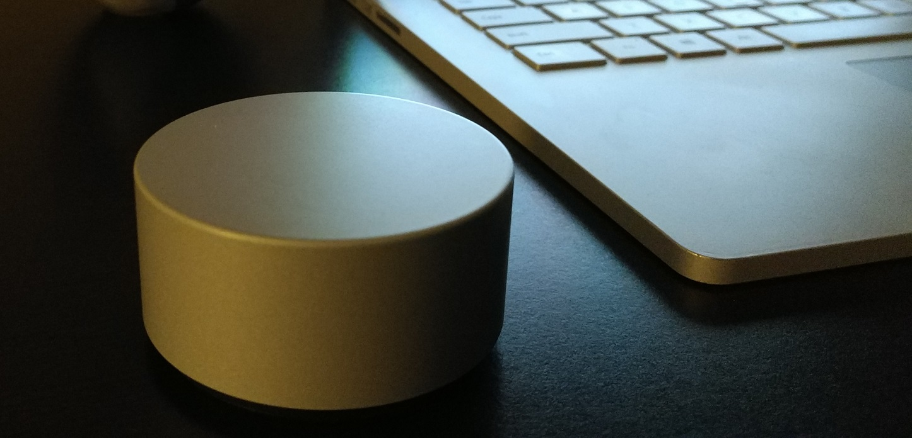

# "Dial-In" Video Effects Demo
An example app to show how to use the UWP RadialController APIs to apply real time video effects

To see this app in action, check out the YouTube video here: 
https://youtu.be/K4soLRNpF4g

* Updating to be included in the Arctic Code Vault
